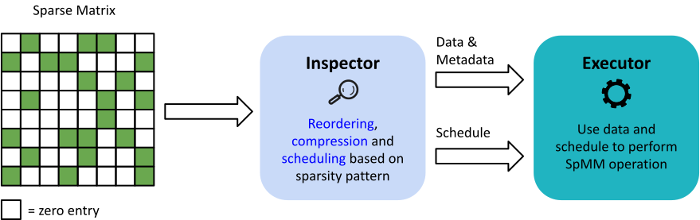
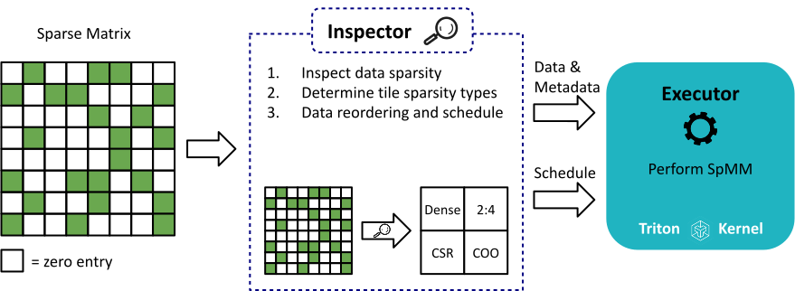

# **STOICC**: The **S**parse **T**ile **MO**sa**IC** **C**ompiler

## Overview

Sparsity is ubiquitous in domains such as machine learning, where weight matrices for linear layers can be pruned to create sparse matrices. To achieve the best balance between model accuracy, memory usage, and performance, different sparse formats are more optimal for different regions of the sparse matrix. However, current tools only allow a single sparse format to be used per matrix.

**We introduce STOICC, a novel tile-based sparsity compiler that enables multiple sparse formats to coexist in the same matrix.**

[Code Coming Soon](/){: .btn .btn-blue }

## Inspector-Executor Tools for Sparsity 

Compilers[^1] must optimize sparse matrix operations to achieve performance. This is commonly done in two phases:

* **The Inspector**: Inspects data sparsity pattern and performs reordering, compression, and scheduling.
* **The Executor**: Uses data and schedule to perform SpMM operations.

## STOICC Pipeline

The STOICC [Inspector](#inspector) takes in a sparse matrix. It then inspects the data sparsity to assign tile sparsity types, compress/reorder data, and create a schedule. This schedule is then used along with the data by an [Executor](#executor) written in [Triton](https://triton-lang.org/) to perform the SpMM operation. Finally, the [Sparse Compiler]()---our modified Triton compiler---is used to lower the executor code to the GPU. 

## Results

Results coming soon
{: .label .label-yellow }

----

### References

[^1]: [L. Wilkinson, K. Cheshmi, and M. M. Dehnavi, ‘Register Tiling for Unstructured Sparsity in Neural Network Inference’, Proc. ACM Program. Lang., vol. 7, no. PLDI, Jun. 2023.](https://doi.org/10.1145/3591302)