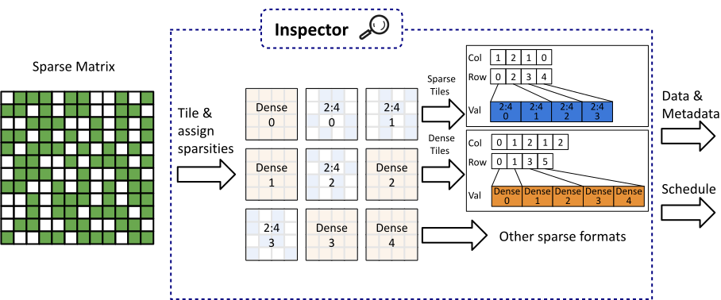
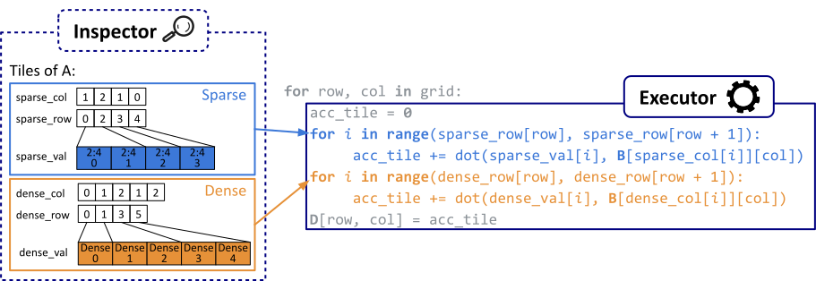

# Inspector

The inspector assigns sparse formats to matrix tiles and reorders data. We currently have support for dense, 2:4, and all-zero tiles. The tiles are then arranged into a tile-level Compressed Sparse Row (CSR) format.

# Executor

A grid is launched with one Triton program per tile of output matrix D. Each program iterates over a row of A and column of B according to the schedule and accumulates the result for its tile.

