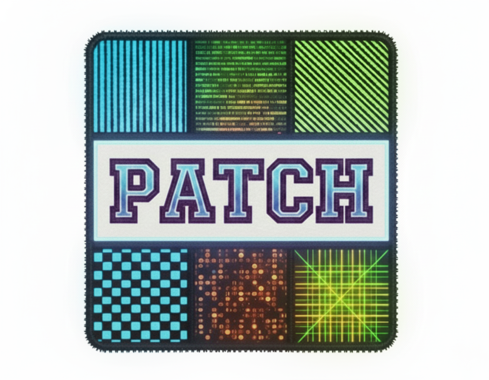
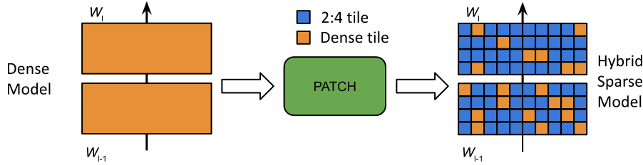
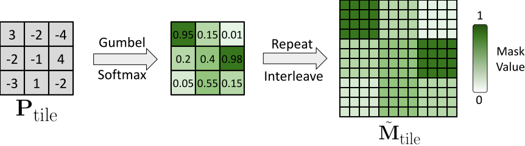
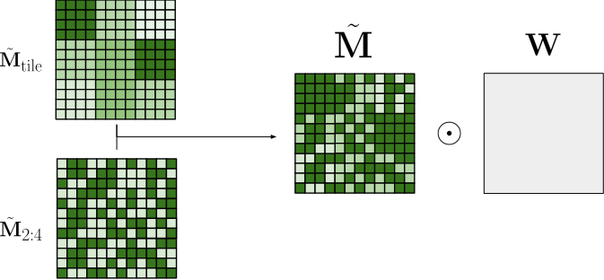

  <a href="https://github.com/Paramathic/patch" class="btn btn-blue">Code Available on GitHub</a>
  <a href="https://www.arxiv.org/abs/2509.23410" class="btn btn-purple">Paper Available on ArXiv</a>

# **PATCH**: Learnable Tile-level Hybrid Sparsity for LLMs
{: .no_toc }

## Table of Contents
{: .no_toc .text-delta }

1. 
{:toc}

## Overview

Large language models (LLMs) deliver state-of-the-art performance but face prohibitive inference costs.
Model pruning is an effective way to reduce these overheads, yet existing approaches face challenge:

- **Unstructured sparsity** preserves accuracy but cannot be accelerated efficiently on GPUs.  
- **Semi-structured 2:4 sparsity** is hardware-friendly but rigid (fixed 50% sparsity), leading to accuracy loss.  

**PATCH bridges this gap** by enabling a *continuous sparsity ratio between 0% and 50%*.  
It partitions each weight matrix into **tiles**, then learns whether each tile should remain **dense** or become **2:4 sparse**, using a differentiable mask learning mechanism.  

This design combines the **flexibility of unstructured pruning** with the **acceleration of structured sparsity**, yielding higher accuracy and real speedups on GPUs. 

---

## How PATCH Prunes

PATCH learns a hybrid mask by formulating selection as two coupled subproblems: (1) deciding which tiles are dense or sparse, and (2) determining the 2:4 sparsity pattern within sparse tiles.  

1. **Tile-level Mask Selection**    

    Each tile in the weight matrix is assigned a learnable logit.  
    Collectively, these logits form a grid **$$\mathbf{P}_{\text{tile}}$$**, where each entry represents the score of keeping the corresponding tile dense versus pruning it into a 2:4 sparse tile.  

    We apply the Gumbel–Softmax relaxation to sample these binary choices in a differentiable way, enabling the mask decisions to be optimized during training.  

    

2. **Within-Tile 2:4 Mask Learning**  
   For tiles selected as sparse, PATCH provides two options for handling the 2:4 mask pattern ($$\mathbf{M}_\text{2:4}$$):  

    - **PATCHTile — Fixed 2:4 pattern:**  
    Uses a pre-computed, kept frozen mask throughout training.  
    This design is*memory-efficient and allows scaling to large models (e.g., 8B parameters on a single 80 GB GPU).

    - **PATCHJoint — Learned 2:4 pattern:**  
      Treats the 2:4 mask as learnable[^1] and optimizes it jointly with tile selection.  
      This provides greater flexibility and typically leads to higher accuracy.

3. **Hybrid Mask Combination**  
   - The final pruning mask interpolates between dense tiles and sparse tiles:  

   $$ \tilde{\mathbf{M}} = \tilde{\mathbf{M}}_{\text{tile}} + (1 - \tilde{\mathbf{M}}_{\text{tile}}) \odot \tilde{\mathbf{M}}_{2:4} $$

   - This yields a global sparsity ratio between **0% and 50%**, controlled by a sparsity regularizer.  

   

---

## Results

### PATCHJoint Results
PATCH achieves a controllable trade-off between sparsity and accuracy.

| **Sparsity** | **Method** | **Pattern** | **Qwen-2.5 0.5B** Acc (↑) | **Qwen-2.5 0.5B** PPL (↓) | **LLaMA-3.2 1B** Acc (↑) | **LLaMA-3.2 1B** PPL (↓) | **Gemma-3 1B** Acc (↑) | **Gemma-3 1B** PPL (↓) |
|:-------------:|:-----------:|:------------:|:--------------------------:|:--------------------------:|:--------------------------:|:--------------------------:|:-----------------------:|:-----------------------:|
| 0 % | Dense | – | 46.00 | 12.08 | 47.70 | 9.06 | 47.01 | 11.67 |
| 50 % | MaskLLM[^1] | 2:4 | 39.33 | 15.22 | 41.04 | 12.93 | 41.84 | 12.82 |
| 45 % | PATCH | Hybrid | 40.29 | 14.57 | 42.08 | 12.23 | 42.80 | 11.96 |
| 35 % | PATCH | Hybrid | 41.15 | 13.84 | 42.72 | 11.67 | 43.30 | 11.48 |
| 25 % | PATCH | Hybrid | 42.39 | 13.47 | 43.81 | 11.00 | 44.07 | 11.17 |

*Average accuracy on 8 zero-shot tasks: MMLU, PIQA, ARC-Easy, ARC-Challenge, WINOGRANDE, OpenBookQA, RACE, and HellaSwag.*

---

### PATCHTile Results
Optimizing tiles only still provides the trade-off at lower cost, enabling larger models to be trained in resource-constrained settings.

| **Sparsity** | **Method** | **Pattern** | **LLaMA-2 7B** Acc (↑) | **LLaMA-2 7B** PPL (↓) | **LLaMA-3.1 8B** Acc (↑) | **LLaMA-3.1 8B** PPL (↓) |
|:-------------:|:-----------:|:------------:|:-----------------------:|:-----------------------:|:------------------------:|:------------------------:|
| 0 % | Dense | – | 54.61 | 5.12 | 60.31 | 5.84 |
| 50 % | MaskLLM[^1] | 2:4 | 48.62 | 6.78 | 52.80 | 8.58 |
| 45 % | PATCH | Hybrid | 48.99 | 6.55 | 53.60 | 8.20 |
| 35 % | PATCH | Hybrid | 50.08 | 6.18 | 55.28 | 7.89 |
| 25 % | PATCH | Hybrid | 51.58 | 5.86 | 56.48 | 7.34 |

*Average accuracy on 8 zero-shot tasks: MMLU, PIQA, ARC-Easy, ARC-Challenge, WINOGRANDE, OpenBookQA, RACE, and HellaSwag.*

### References
{: .no_toc }

[^1]: [Fang et al., 2024. *MaskLLM: Learnable Semi-structured Sparsity for Large Language Models.* NeurIPS 2024.](https://proceedings.neurips.cc/paper_files/paper/2024/file/0e9a05f5ce62284c91e4a33498899124-Paper-Conference.pdf)
