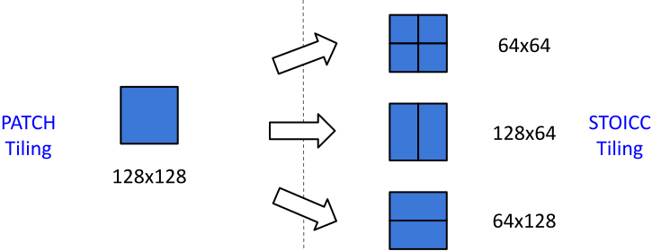

# Efficient Deployment of PATCH with STOICC
{: .no_toc }

## Table of Contents
{: .no_toc .text-delta }

1. 
{:toc}

We leverage the STOICC compiler to accelerate the mixed-tile format produced by PATCH.
We rely on STOICC’s inspector to autotune both tile sizes and execution schedules (i.e., alternative
kernel execution schemes such as split-K parallelism) for the prefill and decoding stages of LLM
inference.

## Model Speedup and Memory Reduction

We benchmark PATCH-compressed Llama-2 7B models at 25 %, 35 %, and 45 % sparsity. All measurements are captured through a CUDA Graph to minimize launch overhead. Each test runs with an input sequence length of 128 and generates 128 tokens with a batch size of 16, reporting end-to-end throughput speedups relative to the dense cuBLAS baseline.  

| **Sparsity Target (%)** | **Speedup vs Dense (A6000)** | **Speedup vs Dense (A100)** | **Memory Reduction vs Dense** |
|:-----------------------:|:----------------------------:|:----------------------------:|:------------------------------:|
| 0  | 1×* | 1×* | 1× |
| 25 | 1.18× | 1.07× | 0.76× |
| 35 | 1.27× | 1.11× | 0.68× |
| 45 | 1.38× | 1.16× | 0.59× |

<sub>*Measured with cuBLAS 12.4.5</sub>

## Tile Shape Choice

The optimal tile size depends on both the **sparsity ratio** and the **matrix shape**. Because PATCH prunes to a global sparsity target, individual layers end up with different densities, which makes the optimal configuration vary across the model.  

In practice, autotuning consistently identifies **subdivisions of 128×128**—specifically 128×64, 64×128, or 64×64—as the most efficient across settings.  When matrices are pruned with a **128×128 tile granularity**, STOICC can flexibly dispatch the computation using any of its smaller sub-tiles at runtime.  

 


## STOICC API

STOICC can be used out of the box with **four lines of code**!

```python
inspector = STOICC.Inspector(use_default_configs=True)
best_exec, best_config = inspector.inspect(X, W, sparse_arg=1)

Wc = inspector.compress(W, best_config)

#SpMM
output = executor(X, *Wc, **best_config)
```


The STOICC inspector will:
- **Compile** and **benchmark** all schedules
- Select the **fastest**
- Cache result based on matrix size and sparsity pattern

STOICC comes with a **ready-made** set of schedules and configurations
- Users can also plug in **custom kernels and configs** if needed

```python
schedules = {
    "sequential": Schedule(
        launcher=..., compressor=...,
        configs = {
            'BLOCK_SIZE_M': [16],
            'BLOCK_SIZE_N': [64, 128],
            'BLOCK_SIZE_K': [64, 128],
            'GROUP_SIZE_M': [4, 8],
            'num_stages': [3],
            'num_warps': [4, 8]
        }
    ),
    "split_k": Schedule(...), 
    ...
}    

insptector = STOICC.Inspector(schedules=schedules)

executor, best_config = inspector.inspect(
    X, W, sparse_arg=1,
)
```


## Code Example

### Tile Shape Constraints at Inference

Decoding and prefill phases favor different tile sizes because their input shapes differ: decoding runs at low batch sizes while prefill operates with large batches. Since each tile size requires a separate compression, using different sizes would force the model to store two compressed copies of the weights for the two phases of inference.  

To avoid this overhead, we select the **optimal tile size for decoding**—the primary bottleneck of LLM inference—and reuse it for prefill, where we autotune only on the remaining parameters. 

The following snippets demonstrate how to **autotune and execute STOICC** for LLM generation, including both prefill and decoding phases.

### Tuning
Assuming `W` is a weight matrix pruned with PATCH, the following example shows how to autotune decoding and prefill, compress once, and build the mixed module:

```python
# Example size for sequence length and batch size
BS = 16
SEQ_LEN = 128

# --- Decoding autotune (low batch size) ---
X_decoding = torch.randn(BS, W.shape[1], dtype = W.dtype, device = "cuda")
inspector = STOICC.Inspector(use_default_configs=True)

best_exec_dec, best_config_dec = inspector.inspect(
    X_decoding,
    W,
    sparse_arg=1,
)

# --- Prefill autotune (reuse block size from decoding) ---
inspector.set_configs(
    STOICC.create_configs(
        BLOCK_N=[best_config_dec["BLOCK_N"]], 
        BLOCK_K=[best_config_dec["BLOCK_K"]]))

X_prefill = torch.randn(BS * SEQ_LEN, W.shape[1], dtype = W.dtype, device = "cuda")
best_exec_pre, best_config_pre = inspector.inspect(
    X_prefill,
    W,
    sparse_arg=1,
)

# --- Compress weights once using decoding config ---
Wc = inspector.compress(W, best_config_dec)

# --- Construct mixed module with both prefill & decoding executors ---
mixed_module = MixedModule(
    compressed_weight=Wc,
    exec_prefill=best_exec_pre,
    exec_decoding=best_exec_dec,
    cfg_prefill=best_config_pre,
    cfg_decoding=best_config_dec,
    N=W.shape[0],
    K=W.shape[1],
)
```

### Forward Pass
The following implementation of the `forward` method in `MixedModule` illustrates how execution is dispatched between prefill and decoding:

```python
class MixedModule(torch.nn.Module):
    ...
    def forward(self, x):
        # Kernel expects a 2D input
        batch_shape = x.shape[:-1]
        x = x.view(-1, x.shape[-1])

        # Prefill phase processes multiple tokens at once
        is_prefill = (batch_shape[-1] != 1)

        # Select the correct kernel configuration based on the phase
        if is_prefill:
            cfg = self.cfg_prefill
            executor = self.exec_prefill
        else:
            cfg = self.cfg_decoding
            executor = self.exec_decoding

        y = executor(
            x,
            *self.compressed_weight,
            M=x.shape[0],
            N=self.N,
            K=self.K,
            **cfg,
        )

        return y.view(*batch_shape, -1)

```