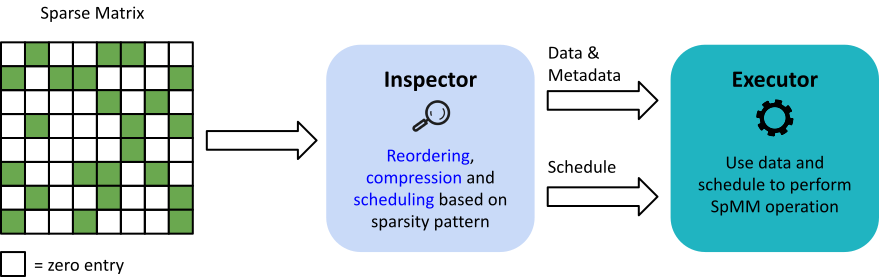
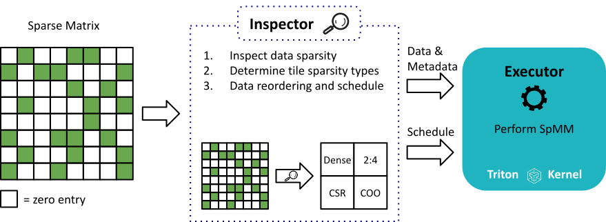
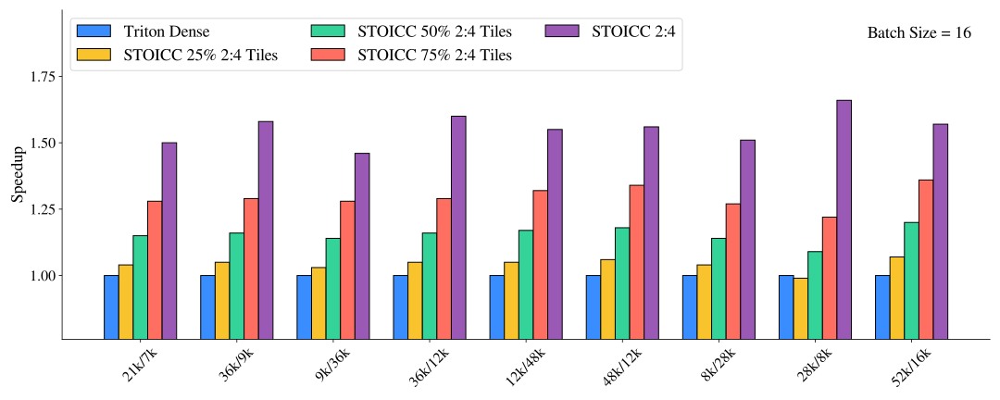
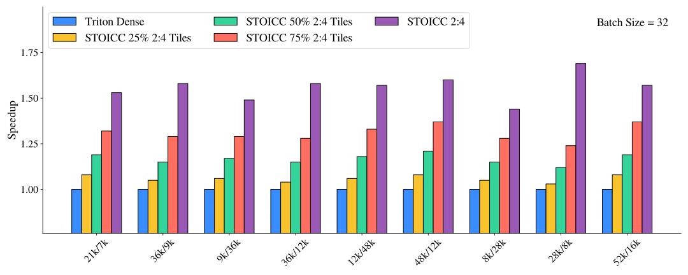
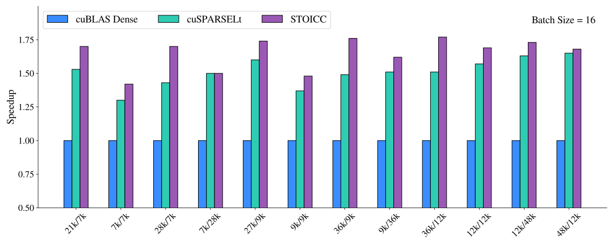
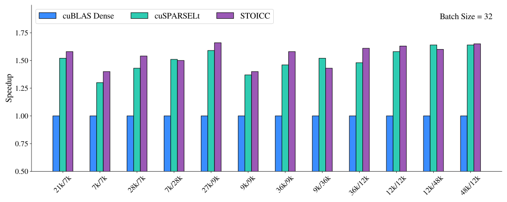

  <a href="https://github.com/Paramathic/stoicc" class="btn btn-blue">Code Available on GitHub</a>

  

# **STOICC**: The **S**parse **T**ile **MO**sa**IC** **C**ompiler

**We introduce STOICC, a novel tile-based sparsity compiler that enables multiple sparse formats to coexist in the same matrix.**

## Inspector-Executor Tools for Sparsity 

Compilers[^1] must optimize sparse matrix operations to achieve performance. This is commonly done in two phases:

* **The Inspector**: Inspects data sparsity pattern and performs reordering, compression, and scheduling.
* **The Executor**: Uses data and schedule to perform SpMM operations.

## STOICC Pipeline

The STOICC [Inspector](#inspector) takes in a sparse matrix. It then inspects the data sparsity to assign tile sparsity types, compress/reorder data, and create a schedule. This schedule is then used along with the data by an [Executor](#executor) written in [Triton](https://triton-lang.org/) to perform the SpMM operation. Finally, the [Sparse Compiler]()---our modified Triton compiler---is used to lower the executor code to the GPU. 

## Results

<!-- Results coming soon
{: .label .label-yellow } -->
We benchmark STOICC on an NVIDIA A100 (80GB) GPU with a mixture of dense tiles and [2:4](https://developer.nvidia.com/blog/structured-sparsity-in-the-nvidia-ampere-architecture-and-applications-in-search-engines/) sparse tiles, where the 2:4 tiles are selected randomly. For example, "50% 2:4 Tiles" corresponds to a scenario where half of the tiles are pruned to 2:4 sparsity while the other half remain dense, resulting in an overall sparsity level of 25% for the whole matrix. The matrix sizes are chosen based on those used in the OPT family of models. 

We also compare STOICC performance with 100% 2:4 tiles against the CUTLASS 2:4 sparse kernel integrated in PyTorch.

----

### References

[^1]: [L. Wilkinson, K. Cheshmi, and M. M. Dehnavi, ‘Register Tiling for Unstructured Sparsity in Neural Network Inference’, Proc. ACM Program. Lang., vol. 7, no. PLDI, Jun. 2023.](https://doi.org/10.1145/3591302)
